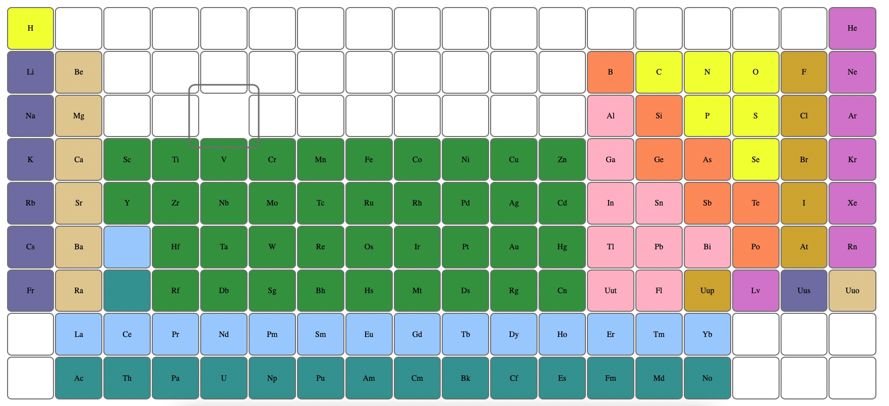

## Periodic Table

**[Test this app yourself](https://maykaltenev.github.io/periodic-table/)**

---

### About Project

This is a website with a periodic table made with :nth:child() selectors and combination targeting the exact starting and stop position.

### How to use this Project

The website is meant to provide understating over the :nth:child() selector and the other pseudo-classes, such as :first-child, :last-child, :first-of-type,
:nth-of-type() and etc.

##### Developed With

- [x] _HTML5_
- [ ] _CSS3_
- [ ] _SASS_
- [x] _SCSS_
- [ ] _React_
- [ ] _Bootstrap_
- [x] _npm_

---

### Contact

Mail: <michaeltenev@mail.com> 
GitHub: [michaeltenev](https://github.com/maykaltenev) 
LinkedIn: [Maykal Tenev](https://www.linkedin.com/in/maykal-tenev-a8729586/)

---

### Used Tools

- [Google Fonts](https://fonts.google.com/)
- [Visual Studio Code](https://code.visualstudio.com/)

### Recourses

- [MDN Web Docs](https://developer.mozilla.org/de/)

---

Made with ❤️ by me
